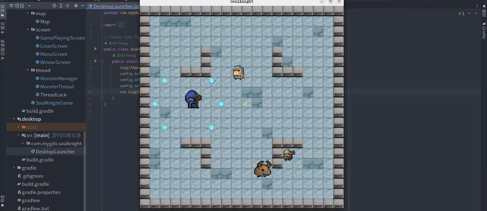

# SoulKnight


A dynamic 2D action game built with Java/LibGDX featuring single-player and multiplayer modes. Battle monsters across multiple levels with unique characters!

## 🏁 How to Play

### 🚀 Quick Start
1. **Single Player**:
   ```bash
   ./gradlew desktop:run
   ```
   *(Or run `DesktopLauncher.java` in your IDE)*

2. **Multiplayer**:

   **Start server:**
   ```bash
   ./gradlew desktop:execute -PmainClass=com.mygdx.soulknight.GameServerLauncher
   ```
   *(Or run `GameServerLauncher.java` in your IDE)*

   **Launch clients:**
   - Run `DesktopLauncher`
   - Select **"Play with Friends"**

### 🎮 Controls

| Action                 | Key        |
|------------------------|------------|
| Movement               | W / A / S / D |
| Shoot                  | SPACE      |
| Enter Portal/Next Wave| ENTER      |
| Pause/Exit             | ESCAPE     |
| GIF Recording*         | T          |

\* Enable in `Variable.java` (`RECORD_FUNCTION = true`)

---

## ✨ Key Features

**Characters:**
- Single-player: Knight
- Multiplayer: Knight, Snowman, Warrior

**Enemies:**
- Master, Collider, Raider *(unique attack patterns)*

**Game Modes:**
- 3 distinct levels: `level0.txt`, `level1.txt`, `level2.txt`
- Online multiplayer *(Netty-based)*

**Special Features:**
- Gameplay GIF recording
- Save/load system
- Custom assets & music

---

## ⚙️ Implementation Details

### 🧱 Project Structure

```
core/src/com/mygdx/soulknight/
├── assets/              # Asset management
├── character/           # Playable characters
│   ├── Knight.java
│   ├── NetKnight.java
│   └── monsters/        # Enemy implementations
├── entity/              # Game objects
├── io/                  # Save/GIF systems
├── map/                 # Level loading
├── network/             # Multiplayer
├── screen/              # Game states
└── thread/              # AI processing

desktop/src/             # Launchers

assets/                  # Game resources
├── basic/               # Core visual assets
├── maps/                # Level files
├── music/               # Audio
└── ui/                  # UI skin files and related figures
```

---

## 🛠️ Technologies

- Java 11+
- LibGDX *(Game framework)*
- Netty *(Networking)*
- Gradle *(Build system)*

---

## ⚠️ Configuration

Modify game parameters in  
`core/src/com/mygdx/soulknight/assets/Variable.java`:

- Character stats  
- Network settings  
- GIF recording options  
- Level paths

## 🎞️ Video

### Single Player

[](https://www.bilibili.com/video/BV11H4y117Cm/?spm_id_from=333.1387.homepage.video_card.click&vd_source=93eb3b30c8b677754663fcca3a67b509)

### Multiplayer

[](https://www.bilibili.com/video/BV1uG411Y7TH/?spm_id_from=333.1387.homepage.video_card.click&vd_source=93eb3b30c8b677754663fcca3a67b509)